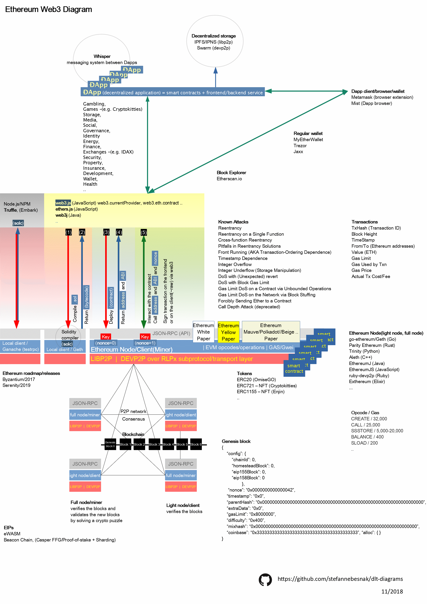

# Ethereum 
## Diagram

<!--
<object data="./export/ethereum-web3-diagram.pdf" type="application/pdf" width="700px" height="700px">
    <embed src="./export/ethereum-web3-diagram.pdf">
        
This browser does not support PDFs. Please download the PDF to view it: <a href="./export/ethereum-web3-diagram.pdf">Download PDF</a>.

    </embed>
</object>
-->

### Web3

### Scaling

## Contributing

Feel free to improve the source file (./source/*.odg) - OpenDocument Graphic file/OpenOffice.org Draw

Pull requests and issues with any corrections or additions are welcome!

## Acknowledgments

https://consensys.github.io/smart-contract-best-practices/known_attacks/

## License

Creative Commons Attribution 4.0 International

<!--

-->

